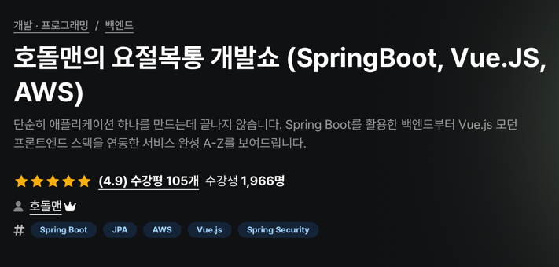

# 호돌맨의 요절복통 개발쇼

강의 수강내용을 정리하는 페이지

[링크 :: 호돌맨의 요절복통 개발쇼](https://www.inflearn.com/course/호돌맨-요절복통-개발쇼/dashboard)

HTTP(Method)는 클라이언트와 서버가 요청/응답을 통해 데이터를 주고받기 위해 사용하는 프로토콜에서 사용되는 방법(혹은 동사)으로, 특정 작업 또는 리소스 액션을 정의합니다. HTTP 메서드는 RESTful API 설계에서도 주요 요소로 자주 활용됩니다. 가장 일반적으로 사용되는 HTTP 메서드는 아래와 같습니다:
### 1. **GET**
- **설명**: 서버에서 리소스를 조회(Read)하기 위해 사용합니다.
- **특징**:
    - 요청 데이터를 **URL의 쿼리 파라미터**로 전달.
    - 서버의 상태나 데이터를 변경하지 않음(**안전성**).
    - 캐싱이 가능.

- **사용 예시**:
    - 특정 ID의 사용자 정보 가져오기: `GET /users/123`
    - 블로그 게시글 리스트 조회: `GET /posts`

### 2. **POST**
- **설명**: 서버에 데이터를 생성(Create)하거나 제출하기 위해 사용합니다.
- **특징**:
    - 요청 데이터는 **HTTP Body**에 포함.
    - 서버의 리소스에 변화를 일으킴(삽입, 등록).

- **사용 예시**:
    - 새로운 사용자 생성: `POST /users`
    - 게시글 업로드: `POST /posts`

### 3. **PUT**
- **설명**: 서버에 존재하는 리소스를 수정(Update)하거나, 없으면 새로 생성합니다.
- **특징**:
    - 자원의 전체 변경으로 간주.
    - 요청 데이터는 전체 객체를 포함하도록 설계.
    - **멱등성** 보장: 같은 요청을 여러 번 반복해도 결과는 동일.

- **사용 예시**:
    - 사용자 정보 수정: `PUT /users/123` (Body에 새 정보 포함)
    - 특정 파일 덮어쓰기: `PUT /files/abc.txt`

### 4. **PATCH**
- **설명**: 서버 리소스의 **일부 수정**(Partial Update)에 사용됩니다.
- **특징**:
    - PUT 메서드와 달리 필드 일부 수정에 적합.
    - 요청 대상의 전체 데이터를 포함하지 않아도 됨.
    - **멱등성 보장**은 사용 여부에 따라 다름.

- **사용 예시**:
    - 사용자 이메일 주소만 수정: `PATCH /users/123/email`

### 5. **DELETE**
- **설명**: 서버에서 리소스를 삭제하기 위해 사용됩니다.
- **특징**:
    - 리소스 삭제가 목적.
    - **멱등성** 보장: 여러 번 실행해도 자원이 이미 삭제된 경우 결과는 동일.

- **사용 예시**:
    - 사용자 삭제: `DELETE /users/123`
    - 게시글 삭제: `DELETE /posts/456`

### 6. **HEAD**
- **설명**: GET과 동일하지만, 리소스의 **헤더** 정보만 반환. (데이터 Body 없이).
- **특징**:
    - 자원에 대한 메타데이터(최종 수정 날짜, 크기 등)만 확인 가능.
    - 주로 **자원의 존재 여부** 확인이나 상태 체크에 사용.

- **사용 예시**:
    - 파일이 서버에 있는지 확인: `HEAD /files/abc.txt`

### 7. **OPTIONS**
- **설명**: 서버에서 지원하는 HTTP 메서드와 옵션에 대한 정보를 반환합니다.
- **특징**:
    - CORS(교차 출처 리소스 공유) 처리 시 요청 전 확인에 사용.

- **사용 예시**:
    - 지원 메서드 확인: `OPTIONS /users`

### 8. 기타 메서드들
- **TRACE**: 요청 경로(라우팅)를 조사. 디버깅 목적으로 사용.
- **CONNECT**: 터널링 목적으로 사용 (주로 HTTPS 사용 시 프록시 서버 연결).

### HTTP 메서드와 RESTful 설계의 관계
HTTP 메서드는 **CRUD**(Create, Read, Update, Delete)의 개념을 RESTful API와 결합하여 자원의 동작과 명확히 대응될 수 있습니다:

| Method | CRUD 동작 | 설명 |
| --- | --- | --- |
| GET | Read | 자원의 조회 |
| POST | Create | 새로운 자원 생성 |
| PUT | Update | 자원의 전체 수정/갱신 |
| PATCH | Update | 자원의 부분 수정 |
| DELETE | Delete | 자원의 삭제 |
각각의 HTTP 메서드는 목적에 맞춰 사용해야 하며, 불필요하게 혼용하면 API의 명확성과 표준성을 저해할 수 있습니다. RESTful 설계에서는 특히 **멱등성**(Idempotency), **안전성**(Safety) 등의 특성을 고려해 설계하는 것이 중요합니다.
궁금한 점이 있다면 편하게 질문해주세요! 😊

## content-type

1. 이전에는 `application/x-www-form-urlencoded` 를 많이 사용했다.
2. 요즘은 일반적으로 `application/json` 을 사용한다.

